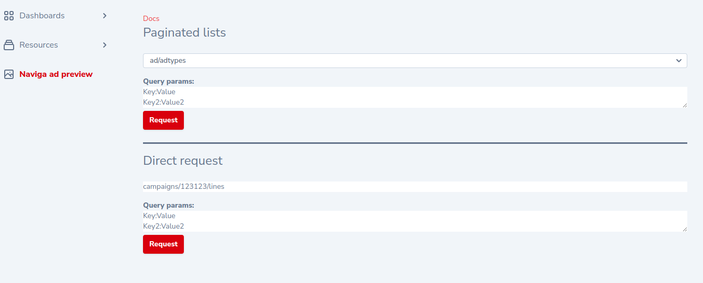
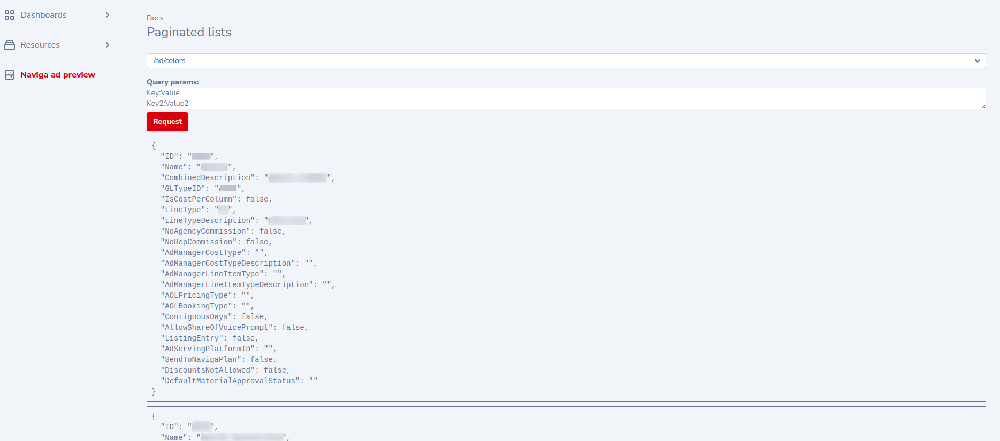

# Laravel nova NavigaAd api requests preview.


[](https://packagist.org/packages/think.studio/nova-naviga-ad-preview)
[](https://packagist.org/packages/think.studio/nova-naviga-ad-preview)
[](https://scrutinizer-ci.com/g/dev-think-one/nova-naviga-ad-preview/build-status/main)
[](https://scrutinizer-ci.com/g/dev-think-one/nova-naviga-ad-preview/?branch=main)
[](https://scrutinizer-ci.com/g/dev-think-one/nova-naviga-ad-preview/?branch=main)

Laravel nova admin tool to call naviga ad api endpoints using UI.

| Nova  | Package |
|-------|---------|
| V4    | V1      |

### Install

```bash
composer require think.studio/nova-naviga-ad-preview
```

Package depends on [laravel-naviga-ad](https://packagist.org/packages/think.studio/laravel-naviga-ad). So please after install configure app
according laravel-naviga-ad installation instructions.





## Credits

- [](https://think.studio/)
